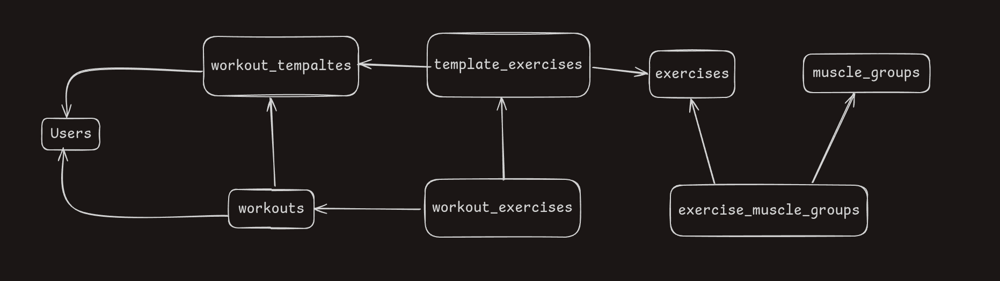

# Workout Tracker API

The `workout-tracker-api` is a simple Node.js backend API project built with TypeScript and PostgreSQL. The main purpose of this project is to build a RESTful APIs with TypeScript and explore backend development using Node.js. This project is not intended for production use it's a fun personal project with the potential to grow based on user feedback and contributions.

## Features
- User creation
- Create and track workout templates with various exercises
- Record sets, reps, weights, and muscle groups
- Swagger documentation for easy API exploration
- Built with TypeScript for type safety
- PostgreSQL as the database

## Database Schema

Below is the database schema for the Workout Tracker API, illustrating the relationships between the various entities:




## Production Demo
Check out the API demo hosted on Railway: https://workout-tracker-api-production.up.railway.app/api-docs


## Getting Started

### Prerequisites
- [Node.js](https://nodejs.org/)
- [PostgreSQL](https://www.postgresql.org/)

### Installation
1. Clone the repository:

```bash
  git clone https://github.com/adriangube/workout-tracker-api.git
  cd workout-tracker-api
``` 

2. Install dependencies:
```bash
  npm install
```

3. Set up your environment variables:

- Duplicate `.env.example` and rename it to `.env`
- Fill in your PostgreSQL connection details and any other required environment variables

4. Start PostgreSQL and pgAdmin using Docker:

```bash
  docker compose up -d
```

### Running the Project
The recommended way to run the project locally is in development mode, as it includes a watch mode that reloads automatically on changes. Use the following commands:

- Start in development: `npm run dev`
- Start in production: `npm run start`

### Additional Scripts
- Run tests: `npm run test` (WIP)
- Build Swagger docs: `npm run build:swagger`

### Server URLs
- Development server: http://localhost:3000
- Swagger documentation: http://localhost:3000/api-docs
- Production demo: https://workout-tracker-api-production.up.railway.app
- Production demo docs: https://workout-tracker-api-production.up.railway.app/api-docs

### Purpose
This project was created as a fun personal side project and it serves as a playground for improving backend development. The API is open to user feedback and suggestions; I'm excited to hear your ideas and add more exercises or muscle groups if requested.

### Contributions
I'm open to contributions! Feel free to fork the project, make improvements, and open a Merge Request (MR). Whether it's feedback, new features, bug fixes, or additional exercises, your input is welcome.

### License
This project is open-source and available under the MIT License.
